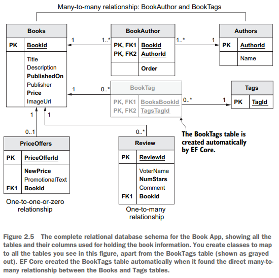
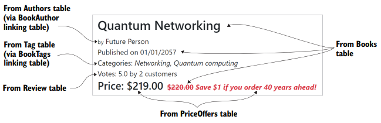
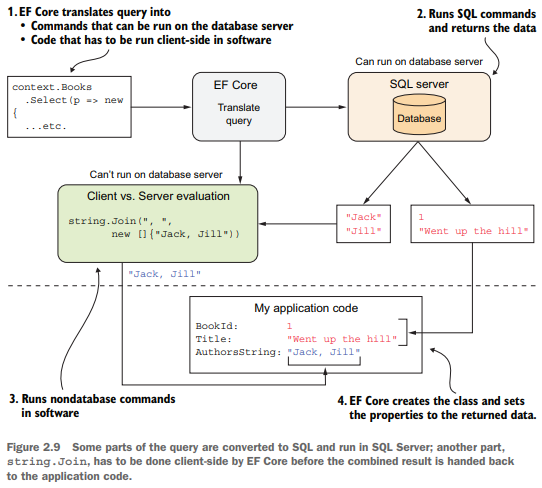

Chapter 2-Quering the Database
==============================

## The Book App's relational database





```C#
public class Book {
   public int BookId { get; set; } 
   public string Title { get; set; }
   public string Description { get; set; }
   public DateTime PublishedOn { get; set; }
   public string Publisher { get; set; }
   public decimal Price { get; set; }
   public string ImageUrl { get; set; }
   public bool SoftDeleted { get; set; }

   //-----------------------------------------------
   //relationships
   public PriceOffer Promotion { get; set; } 

   public ICollection<Review> Reviews { get; set; } 

   public ICollection<Tag> Tags { get; set; }   // why use ICollection over IEnumerable will be covered in chapter 14

   public ICollection<BookAuthor> AuthorsLink { get; set; } 
}

public class BookAuthor {
   public int BookId { get; set; } 
   public int AuthorId { get; set; } 
   public byte Order { get; set; } 

   //-----------------------------
   //Relationships
   public Book Book { get; set; } 
   public Author Author { get; set; } 
}

public class Author {
   public int AuthorId { get; set; }
   public string Name { get; set; }

   //------------------------------
   //Relationships
   public ICollection<BookAuthor> BooksLink { get; set; } 
}

public class PriceOffer {
   public int PriceOfferId { get; set; }
   public decimal NewPrice { get; set; }
   public string PromotionalText { get; set; }

   //-----------------------------------------------
   //Relationships
   public int BookId { get; set; } 
}

public class Review {
   public int ReviewId { get; set; }
   public string VoterName { get; set; }
   public int NumStars { get; set; }
   public string Comment { get; set; }

   //-----------------------------------------
   //Relationships
   public int BookId { get; set; } 
}

public class Tag {
   [Key]
   [Required]
   [MaxLength(40)]
   public string TagId { get; set; }

   public ICollection<Book> Books { get; set; }
}

public class EFCoreContext : DbContext {
   public EFCoreContext(DbContextOptions<EFCoreContext> options) : base(options) { }
   
   public DbSet<Book> Books { get; set; }
   public DbSet<Author> Authors { get; set; }
   public DbSet<PriceOffer> PriceOffers { get; set; }
   public DbSet<Tag> Tags { get; set; }
   
   /* don't need this method since it is already been configure at startup.cs
   protected override void OnConfiguring(DbContextOptionsBuilder optionsBuilder) {
      optionsBuilder.UseSqlServer(connectionString);
   }
   */
   
   protected override void OnModelCreating(ModelBuilder modelBuilder) {
      modelBuilder.Entity<BookAuthor>()
         .HasKey(x => new { x.BookId, x.AuthorId });
   }
}
```

## Loading related data

EF Core won't load any relationships in an entity class unless you ask it to. If you load a Book class, each of the relationship properties in the Book entity class (Promotion, Reviews, and AuthorsLink) will be null by default. 

This default behavior of not loading relationships is correct, because it means that EF Core minimizes the database accesses. If you want to load a relationship, you need to add code to tell EF Core to do that. The following sections describe the four approaches that get EF Core to load a relationship.


#### Eager Loading

Eager Loading tells EF Core to load the relationship in the same query that loads the primary entity class. Eager loading is specified via two fluent methods, `Include` and `ThenInclude`:
```C#
var firstBook = context.Books
   .Include(book => book.Reviews)
   .FirstOrDefault();

var firstBook2 = context.Books
   .Include(book => book.AuthorsLink)
   .ThenInclude(bookAuthor => bookAuthor.Author)
   .Include(book => book.Reviews)
   .Include(book => book.Tags)
   .Include(book => book.Promotion)
   .FirstOrDefault();
```


The only LINQ commands you can use in the Include or ThenInclude methods are Where, OrderBy, OrderByDescending, ThenBy, ThenByDescending, Skip, and Take, for example:
```C#
var firstBook = context.Books.AsNoTracking()           
    .Include(book => book.AuthorsLink.OrderBy(bookAuthor => bookAuthor.BookId))   // load AuthorsLink order by BookId
    .ThenInclude(bookAuthor => bookAuthor.Author)
    .Include(book => book.Reviews)
    .FirstOrDefault();
```

EF Core 5 added the ability to sort or filter the related entities when you use the Include or ThenInclude methods. This capability is helpful if you want to load only a subset of the related data (such as only Reviews with five stars, for example:
```C#
var firstBook = context.Books.AsNoTracking()           
    ...
    .Include(book => book.Reviews.Where(review => review.NumStars == 5))   // instead of loading a book's all reviews, only load the books's five star review
```


#### Explicit Loading

You can also load any other relationships after you've loaded the primary entity class:
```C#
var firstBook = context.Books.First();

context.Entry(firstBook).Collection(book => book.AuthorsLink).Load();   // Entry() and Collection() seems to related to change tracking?

context.Entry(firstBook).Reference(book => book.Promotion).Load();    // note that we use Reference() here compared to Collection() above
```

Alternatively, explicit loading can be used to apply a query to the relationship instead of loading the relationship first then access the relationship via primary entity class:
```C#
var starRatings = context.Entry(firstBook)
    .Collection(book => book.Reviews)
    .Query().Select(review => review.NumStars)  // Query() method returns a IQuerable<Review>, note that the relationship hasn't been loaded yet
    .ToList();                                  // ToList() causes the relationship loaded
```

The downside of explicit loading is more database round trips, which can be inefficient. 


## Select Loading

The third approach to loading data is using the LINQ Select method to pick out the data you want:
```C#
var books = context.Books
    .Select(book => new {
       book.Title,
       book.Price,
       NumReviews = book.Reviews.Count,
       })
    .ToList();
```
The advantage of this approach is that only the data you need is loaded, which can be more efficient if you don't need all the data. For listing 2.8, only one SQL SELECT command is required to get all that data, which is also efficient in terms of database round trips. EF Core turns the p.Reviews.Count part of the query into an SQL command, so that count is done inside the database:
```C#
SELECT "b"."Title", "b"."Price", (
   SELECT COUNT(*)
   FROM "Review" AS "r"
   WHERE "b"."BookId" = "r"."BookId") AS "NumReviews"
FROM "Books" AS "b"
```
The downside to the select-loading approach is that you need to write code for each property/calculation you want. In section 7, I show a way to automate this process.


## Lazy loading

If you access a navigational property that isn't loaded, EF Core will execute a database query to load that navigational property

You can set up lazy loading in either of two ways:

1. Adding the Microsoft.EntityFrameworkCore.Proxies library when configuring your DbContext

2. Injecting a lazy loading method into the entity class via its constructor (discussed in Chapter 6)

For 1, it locks you into setting up lazy loading for all the relationships, and you need to add the keyword `virtual` to ***every*** property that is a relationship and add the extension method UseLazyLoadingProxies when setting up the DbContext:
```C#
public class BookLazy {
   public int BookLazyId { get; set; }
   //… Other properties left out for clarity
   public virtual PriceOffer Promotion { get; set; }   
   public virtual ICollection<Review> Reviews { get; set; }
   public virtual ICollection<BookAuthor> AuthorsLink { get; set; }
}


// startup.cs
public void ConfigureServices(IServiceCollection services) {
   var connection = Configuration.GetConnectionString("DefaultConnection");

   services.AddDbContext<EFCoreContext>(options => 
      options.UseSqlServer(connection)
             .UseLazyLoadingProxies();
   );
}

// then you don't need to use Include/ThenInclude
var book = context.BookLazy.Single();  // one database access for BookLazy table
var reviews = book.Reviews.ToList();   // one database access for Review table

// You can still an Include on a virtual relational property to get better performance
// The lazy loading will see that the property has been loaded and not load it again.
var book = context.BookLazy.Include(book => book.Reviews).Single();  // one database access for BookLazy table joined with Review table
var reviews = book.Reviews.ToList();   // no database access is required
```

## Client vs Server Evaluation

All the queries you'be seen so far are ones that EF Core can convert to commands that can be run on the database server. But EF Core has a feature called ***clients vs server evaluation***, which allows you to run code at the last stage of the query, that can't be converted to database commands. EF Core
runs these non-server-runnable commands after the data has come back from the database. For example:
```C#
var firstBook = context.Books
   .Select(book => new {
      book.BookId,
      book.Title,
      AuthorsString = string.Join(", ", book.AuthorsLink.OrderBy(ba => ba.Order).Select(ba => ba.Author.Name))   // string.Join executed on the client side
   }
).First();
```
If EF Core didn't use client vs. server evaluation for that task, EF Core would need to 
(a) send back a list of all the Author names and
(b) add an extra step after the query, using a foreach section to apply a `string.Join` to each book's authors.



The example in listing 2.10 is fairly simple, but you need to be careful how you use a property created by client vs. server evaluation. Using client vs. server evaluation on a property means that you cannot use that property in any LINQ command that would produce database commands, such as any commands that sort or filter that property. If you do, you will get an `InvalidOperationException`, with a message that contains the words could not be translated. In figure 2.9, for example, if you tried to sort or filter on the AuthorsString, you would get the could not be translated exception:
```C#
var books = context.Books
   .Select(book => new {
      book.BookId,
      book.Title,
      AuthorsString = string.Join(", ", book.AuthorsLink.OrderBy(ba => ba.Order).Select(ba => ba.Author.Name))   // string.Join executed on the client side
   }
)

books.OrderBy(b => b.AuthorsString);

books.ToList()   //throw InvalidOperationException: LINQ expression 'DbSet<Book>() .OrderBy(b => string.Join( separator: ", ", value: new string[]{ b.Title }))
                 //could not be translated. Either rewrite the query in a form that can be translated, or switch to client evaluation explicitly by inserting ///a call to 'AsEnumerable', 'AsAsyncEnumerable', 'ToList', or 'ToListAsync'.
```
Now it should be more clear to you that why `InvalidOperationException` is thrown, because of `string.Join()` C# function, it has to execute on client side, but you further add `books.OrderBy(b => b.AuthorsString)`, which EF Core has to build the corresponding expression tree and execute it on server side, which interfere the LINQ executation.

## Building Complex Queries


You start with the class you’re going to put the data in. This type of class, which exists only to bring together the exact data you want, is referred to in various ways. In ASP.NET, it is referred to as a *ViewModel*, but that term also has other connotations and uses; therefore, I refer to this type of class as a ***Data Transfer Object*** (DTO)

<div class="alert alert-info pt-2 pb-0" role="alert">
   There are lots of definitions of a Data Transfer Object (DTO), but the one that fits my use of DTOs is "object that is used to encapsulate data, and send it from one subsystem of an application to another" (Stack Overflow, https://stackoverflow.com/a/1058186/1434764).
</div>

```C#
// The DTO BookListDto
public class BookListDto {
   public int BookId { get; set; }
   public string Title { get; set; }
   public DateTime PublishedOn { get; set; }  // Although the publication date isn't shown, you'll want to sort by it, so you have to include it.
   public decimal Price { get; set; }         // The norma selling price of the book
   public decimal ActualPrice { get; set; }   // Selling price—either the normal price or the promotional.NewPrice if present 
   public string PromotionPromotionalText { get; set; } 
   public string AuthorsOrdered { get; set; }  // String to hold the comma-delimited list of authors' names e.g "Smith, Jackson"
   public int ReviewsCount { get; set; }
   public double? ReviewsAverageVotes { get; set; }
   public string[] TagStrings { get; set; }
}
```
To work with EF Core's select loading, the class that's going to receive the data *must have a default constructor (which you can create without providing any properties to the constructor), the class must not be static, and the properties must have public setters*

```C#
public static class BookListDtoSelect {
   public static IQueryable<BookListDto> MapBookToDto(this IQueryable<Book> books) {
      return books.Select(book => new BookListDto {
         BookId = book.BookId,
         Title = book.Title,
         Price = book.Price,
         PublishedOn = book.PublishedOn,
         ActualPrice = book.Promotion == null ? book.Price : book.Promotion.NewPrice,
         PromotionPromotionalText = book.Promotion == null ? null : book.Promotion.PromotionalText,
         AuthorsOrdered = string.Join(", ", book.AuthorsLink.OrderBy(ba => ba.Order).Select(ba => ba.Author.Name)),
         ReviewsCount = book.Reviews.Count,
         ReviewsAverageVotes = book.Reviews.Select(review => (double?)review.NumStars).Average(),
         TagStrings = book.Tags.Select(x => x.TagId).ToArray()
      });
   }
}
```


----------------------------------------------------------------------------
https://stackoverflow.com/questions/16966213/entity-framework-find-vs-where?noredirect=1&lq=1

The point is that Find() starts by searching in the local cache of the context and then, if no match, sends a query to the DB.

Call to Where() always sends a query to the DB.

<!-- <div class="alert alert-info p-1" role="alert">
    
</div> -->

<!--  -->

<!-- <code>&lt;T&gt;</code> -->

<!-- <div class="alert alert-info pt-2 pb-0" role="alert">
    <ul class="pl-1">
      <li></li>
      <li></li>
    </ul>  
</div> -->

<!-- <ul>
  <li><b></b></li>
  <li><b></b></li>
  <li><b></b></li>
  <li><b></b></li>
</ul>  -->

<!-- <span style="color:red">hurt</span> -->

<style type="text/css">
.markdown-body {
  max-width: 1800px;
  margin-left: auto;
  margin-right: auto;
}
</style>

<link rel="stylesheet" href="./zCSS/bootstrap.min.css">
<script src="./zCSS/jquery-3.3.1.slim.min.js"></script>
<script src="./zCSS/popper.min.js"></script>
<script src="./zCSS/bootstrap.min.js"></script>